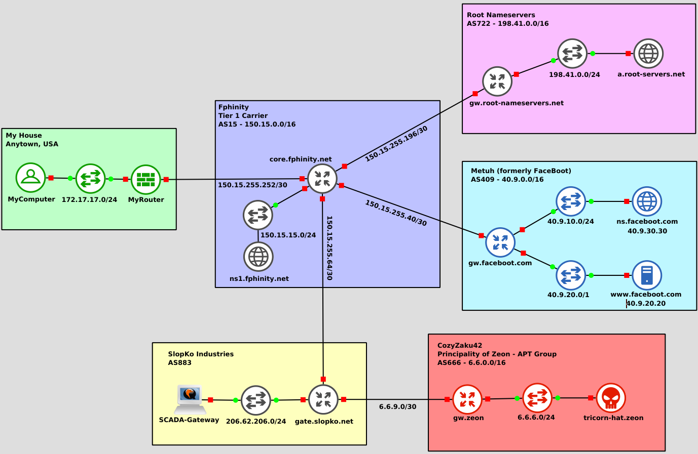

# InternNot

A small fake Internet. It has root DNS. It has a Tier 1 ISP.
It has Gundam references. Assume all information in this
repo is public and any information should only be used on
test systems fully isolated from any real network.

# Contents

## nodes

Interesting files organized by Autonomous
System. These should provide enough to reimplement this
phony Internet on new versions.

# TODO

This was originally built to allow some experiments related to the Facebook BGP
outage in 2021. The following enhancements would allow for more fun and games.

* CloutFare - A Content Delivery Network (CDN) service with anycast DNS forwarders.
* Setup some end clients to use the CloutFare DNS forwarders.
* Have our super not nice hackers advertise the anycast net for the CloudFare forwarders.
* Go ham and setup RPKI! That needs certs and servers and stuff.
  FRR and OpenBSD have RPKI clients. Setting up a fake internet registry and the
  server side will be interesting. See https://manrs.org/wp-content/uploads/2022/07/2022-07-04-RPKI-Week-Tutorial.pdf
